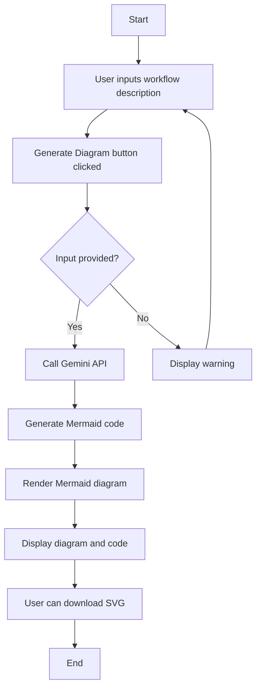

# Workflow Diagram Generator

>Generate beautiful, interactive workflow diagrams from text descriptions using Gemini✦ and Mermaid.js! 🤖✨

## 🎬 Demo


## 📊 Application Flow



## 🌟 Features

- 🤖 AI-powered diagram generation using Google's Gemini API
- 📊 Interactive Mermaid.js diagrams
- 💾 Download diagrams as SVG files
- 🎨 Clean and intuitive user interface
- 📚 Example workflows for inspiration

## 🛠️ Technologies Used

- Streamlit
- Google Generative AI (Gemini API)
- Mermaid.js
- Python

## 🚀 Getting Started

### Prerequisites

- Python 3.7+
- A Google API key for Gemini

### Installation

1. Clone the repository:
   ```
   git clone https://github.com/yourusername/workflow-diagram-generator.git
   cd workflow-diagram-generator
   ```

2. Install the required packages:
   ```
   pip install -r requirements.txt
   ```

3. Create a `.env` file in the project root and add your Google API key:
   ```
   GOOGLE_API_KEY=your_api_key_here
   ```

### Running the Application

Run the Streamlit app:
```
streamlit run app.py
```

Visit `http://localhost:8501` in your web browser to use the application.

## 📝 How to Use

1. Enter a description of your workflow process in the text area.
2. Click the "Generate Diagram" button.
3. View the generated diagram and Mermaid code.
4. Download the diagram as an SVG file if desired.
5. Explore example workflows for inspiration.

## 💡 Tips for Best Results

1. Be clear and specific in your workflow description.
2. Include key steps, decision points, and connections between elements.
3. Mention any parallel processes or conditions if applicable.
4. If the generated diagram isn't perfect, you can always edit the code manually.

## 📖 Detailed Guide

For a comprehensive guide on how this project works and how to make the most of it, check out our detailed blog post on Medium:

[How to Generate Workflow Diagrams Using Gemini✦](https://medium.com/google-cloud/how-to-generate-workflow-diagrams-using-gemini-8d3d538bd2e7)

## 🤝 Contributing

Contributions, issues, and feature requests are welcome! Feel free to check [issues page](https://github.com/Gitesh08/workflow-diagram-generator/issues).

## 📜 License

This project is [MIT](https://choosealicense.com/licenses/mit/) licensed.

## 👨‍💻 Author

**Gitesh Mahadik**

- LinkedIn: [@gitesh-mahadik](https://www.linkedin.com/in/gitesh-mahadik-7487961a0/)
- Github: [@Gitesh08](https://github.com/Gitesh08)
- Medium: [@gitesh08](https://medium.com/@gitesh08)

## 🙏 Acknowledgements

- [Streamlit](https://streamlit.io/)
- [Google Generative AI](https://cloud.google.com/ai-platform/docs/generative-ai)
- [Mermaid.js](https://mermaid-js.github.io/mermaid/#/)

---

Built with ❤️ by Gitesh Mahadik
